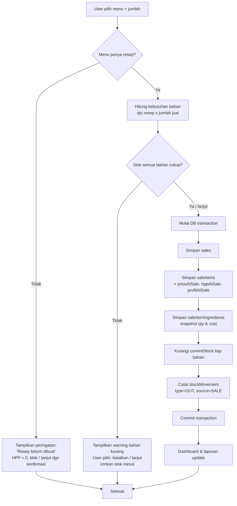
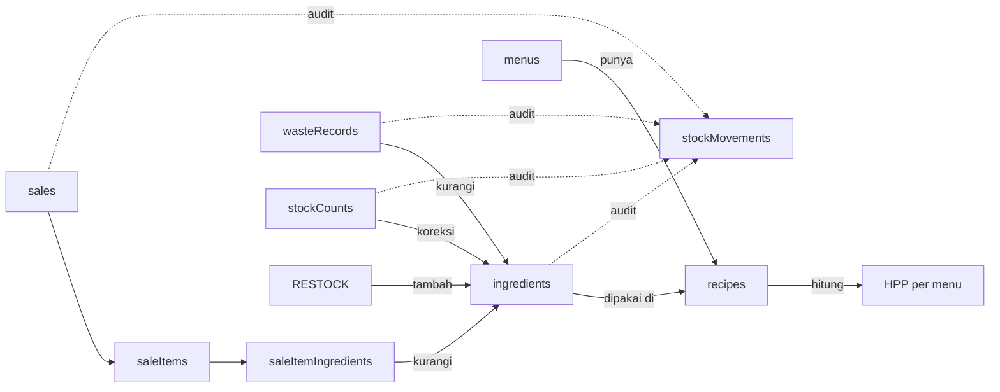

# PRD — Web App Inventory & HPP untuk UMKM F&B Kecil

> **Nama produk yang diusulkan: "Takar"**
> Diambil dari kata *takaran*, karena masalah inti UMKM F&B kecil adalah takaran bahan yang nggak konsisten bikin HPP bocor. Tagline: *"Takar bahanmu, jaga untungmu."*
>
> Alternatif nama lain: **Stokku**, **Dapurin**, **Bahanku**, **HematHPP**.

**Versi:** 1.0 (MVP) · **Tipe:** Local-first web app (tanpa backend) · **Status:** Siap development

---

## Daftar Isi
1. [Ringkasan Produk](#1-ringkasan-produk)
2. [Problem Statement](#2-problem-statement)
3. [Target User](#3-target-user)
4. [Scope MVP](#4-scope-mvp)
5. [Fitur Must / Should / Could Have](#5-fitur-must--should--could-have)
6. [User Stories](#6-user-stories)
7. [User Flow Utama](#7-user-flow-utama)
8. [Flowchart Sistem](#8-flowchart-sistem)
9. [Database Schema Final (Dexie.js)](#9-database-schema-final-dexiejs)
10. [Struktur Folder Project](#10-struktur-folder-project)
11. [Wireframe Kasar per Halaman](#11-wireframe-kasar-per-halaman)
12. [Acceptance Criteria tiap Fitur](#12-acceptance-criteria-tiap-fitur)
13. [Development Task Breakdown](#13-development-task-breakdown)
14. [Edge Cases yang Harus Ditangani](#14-edge-cases-yang-harus-ditangani)
15. [Risiko Teknis & Produk](#15-risiko-teknis--produk)
16. [Rekomendasi Urutan Pengerjaan MVP](#16-rekomendasi-urutan-pengerjaan-mvp)
17. [Bonus: MVP Paling Kecil (1 Minggu)](#17-bonus-mvp-paling-kecil-yang-bisa-mulai-dicoding-dalam-1-minggu)

---

## 1. Ringkasan Produk

**Takar** adalah web app *inventory & HPP tracker* untuk UMKM F&B kecil (coffee shop rumahan, booth minuman, usaha makanan kecil). Bukan aplikasi kasir besar.

Cara kerjanya simpel: user mendata **bahan baku**, membuat **menu**, lalu menyusun **resep (BOM)** tiap menu. Dari resep itu sistem otomatis menghitung **HPP** dan **profit kotor** per menu. Saat ada **penjualan**, stok bahan **berkurang otomatis** sesuai resep. User juga bisa mencatat **waste/gagal produksi** dan melakukan **stok opname** untuk mencocokkan stok sistem vs fisik.

Semua data disimpan **lokal di browser** pakai IndexedDB (via Dexie.js), tanpa backend. Ada fitur **export/import JSON** untuk backup. UI dirancang **mobile/tablet friendly** dengan tombol besar untuk input penjualan cepat.

**Yang membuat Takar beda:** fokus ke *"ke mana perginya bahanku dan berapa untung asliku"*, bukan sekadar mesin kasir.

---

## 2. Problem Statement

Owner UMKM F&B kecil punya masalah konkret:

- **Stok bahan tidak terpantau** → sering kehabisan bahan saat lagi ramai, tanpa sadar.
- **HPP bocor** → takaran nggak konsisten, jadi modal per cup/porsi tidak jelas.
- **Tidak tahu profit kotor per menu** → asal jualan, ujung bulan bingung kok untung tipis.
- **Bahan berkurang tanpa jejak** → nggak bisa bedakan bahan habis karena terjual, kebuang (waste), trial resep, atau salah input.
- **Aplikasi kasir besar terlalu ribet** → kebanyakan fitur, mahal, dan tidak menjawab masalah HPP.

**Inti masalah:** UMKM butuh cara sederhana untuk tahu **(a)** berapa stok bahan sekarang, **(b)** berapa modal & untung tiap menu, dan **(c)** ke mana perginya bahan baku — tanpa harus jadi ahli akuntansi.

---

## 3. Target User

**Primary user: Owner UMKM F&B kecil (sering merangkap operator).**

| Karakteristik | Detail |
|---|---|
| Tipe usaha | Coffee shop rumahan, booth minuman, makanan kecil (roti bakar, spaghetti, mac n cheese) |
| Skala | 1 outlet, dikelola sendiri / 1–3 orang |
| Kondisi sekarang | Catat stok manual (buku/Excel/ingatan) |
| Kemampuan teknis | Rendah–menengah, terbiasa pakai HP |
| Device | Mayoritas HP, sebagian tablet di meja kasir |
| Kebutuhan | Cepat, simpel, bahasa sehari-hari (bukan istilah akuntansi) |

**Contoh nyata:** brand rumahan **Latteva** — jual kopi, matcha, es teh, roti bakar, spaghetti, mac n cheese.

**Bukan target (MVP):** restoran besar, multi-cabang, usaha yang butuh POS lengkap + integrasi pembayaran.

---

## 4. Scope MVP

### ✅ Masuk MVP
- Dashboard ringkas
- CRUD Bahan Baku
- CRUD Menu
- Resep menu / BOM
- HPP otomatis per menu
- Restock bahan (+ update harga rata-rata)
- Input penjualan cepat (stok berkurang otomatis)
- Stock movement (riwayat/audit stok)
- Waste / gagal produksi (mode bahan & mode menu)
- Stok opname / koreksi stok
- Laporan sederhana (penjualan, profit, waste, stok menipis)
- Export/Import data (JSON) untuk backup
- Pengaturan toko (nama, mata uang, ambang stok rendah)

### ❌ TIDAK masuk MVP (jangan dikerjakan dulu)
Multi cabang · Role kasir/admin kompleks · Login multi-user · Integrasi QRIS · Marketplace (Grab/GoFood) · Barcode scanner · Supplier management kompleks · Expiry date per batch · Payroll/karyawan · Accounting lengkap · Sync cloud (fase berikutnya)

---

## 5. Fitur Must / Should / Could Have

### 🔴 Must Have (tanpa ini produk nggak jalan)
- CRUD Bahan Baku (+ stok, satuan, harga)
- CRUD Menu
- Resep / BOM per menu
- HPP otomatis per menu
- Input penjualan cepat → stok berkurang otomatis
- Stock movement (audit trail)
- Snapshot HPP & bahan saat penjualan
- Penyimpanan lokal (IndexedDB/Dexie)
- Export / Import JSON (backup)

### 🟡 Should Have (penting, tapi bisa nyusul sedikit)
- Restock dengan moving average cost
- Waste / gagal produksi (mode bahan & menu)
- Stok opname / koreksi stok
- Dashboard ringkas
- Indikator status stok (aman / menipis / habis)
- Laporan sederhana harian

### 🟢 Could Have (kalau sempat / fase setelahnya)
- PWA installable + offline penuh
- Filter & pencarian bahan/menu
- Export ke Excel (selain JSON)
- Bahan optional / ekstra (extra shot, extra sosis)
- Grafik tren penjualan & profit
- Reminder restock otomatis

---

## 6. User Stories

**Bahan Baku**
- Sebagai owner, saya ingin menambah bahan baku beserta satuan & stok awal, supaya bisa mulai memantau stok.
- Sebagai owner, saya ingin melihat status stok (aman/menipis/habis) sekilas, supaya tahu mana yang harus dibeli.
- Sebagai owner, saya ingin restock bahan dan input harga beli, supaya stok & harga rata-rata terupdate.

**Menu & Resep**
- Sebagai owner, saya ingin membuat menu dengan harga jual, supaya bisa dijual.
- Sebagai owner, saya ingin menyusun resep (bahan + takaran) tiap menu, supaya HPP terhitung otomatis.
- Sebagai owner, saya ingin melihat HPP dan profit kotor tiap menu, supaya tahu menu mana yang paling untung.

**Penjualan**
- Sebagai owner, saya ingin input penjualan cukup dengan klik menu + jumlah, supaya cepat saat ramai.
- Sebagai owner, saya ingin stok bahan otomatis berkurang setelah penjualan, supaya tidak perlu hitung manual.
- Sebagai owner, saya ingin transaksi lama tidak berubah walau harga/resep diubah nanti, supaya laporan tetap akurat.

**Waste**
- Sebagai owner, saya ingin mencatat bahan yang tumpah/terbuang, supaya stok & kerugian tercatat.
- Sebagai owner, saya ingin mencatat menu gagal produksi, supaya stok bahan berkurang sesuai resep.

**Stok Opname**
- Sebagai owner, saya ingin mencocokkan stok sistem dengan stok fisik, supaya bisa deteksi selisih (bocor/hilang).

**Laporan & Backup**
- Sebagai owner, saya ingin melihat ringkasan penjualan & profit harian, supaya tahu performa hari ini.
- Sebagai owner, saya ingin export data ke file, supaya aman kalau browser terhapus.
- Sebagai owner, saya ingin import data dari file backup, supaya bisa pindah device / pulihkan data.

---

## 7. User Flow Utama

**Flow Setup Awal (sekali di awal)**
```
Input Bahan Baku → Input Menu → Buat Resep tiap Menu → HPP terhitung otomatis → Siap jualan
```

**Flow Penjualan (paling sering dipakai)**
```
Pilih menu + jumlah → cek resep ada? → cek stok cukup? 
→ simpan transaksi → buat saleItems → simpan snapshot saleItemIngredients 
→ kurangi stok bahan → catat stockMovement (OUT/SALE) → dashboard update
```

**Flow Restock**
```
Pilih bahan → input qty masuk + harga beli → update stok → 
hitung ulang avgCostPerUnit (moving average) → catat stockMovement (IN/RESTOCK)
```

**Flow Waste**
```
Pilih mode (bahan / menu)
 ├─ Bahan: pilih bahan + qty terbuang
 └─ Menu : pilih menu + jumlah gagal → ambil resep → hitung total bahan
→ kurangi stok → simpan wasteRecord → catat stockMovement (WASTE)
```

**Flow Stok Opname**
```
Buka halaman opname → sistem tampilkan stok sistem → user input stok fisik 
→ hitung selisih → simpan → catat stockMovement (ADJUST) → stok diperbarui
```

---

## 8. Flowchart Sistem

### Flowchart Penjualan (paling kritikal)



### Flowchart Alur Data Umum



---

## 9. Database Schema Final (Dexie.js)

> **Catatan desain penting:**
> 1. **Satuan tunggal per bahan.** Tiap bahan punya 1 satuan dasar (gram/ml/pcs). Resep WAJIB pakai satuan yang sama. Ini menghindari konversi unit yang ribet dan rawan bug di MVP.
> 2. **Moving average cost.** `avgCostPerUnit` di-update tiap restock pakai rata-rata tertimbang. Ini bikin HPP akurat saat harga naik-turun.
> 3. **Snapshot di penjualan.** `saleItems` & `saleItemIngredients` menyimpan harga/qty/cost saat itu. Jadi kalau resep atau harga diubah nanti, transaksi lama TIDAK ikut berubah.
> 4. **`stockMovements` adalah single source of truth** untuk audit. Setiap perubahan stok wajib lewat sini.

### Definisi Dexie

```js
// db.js
import Dexie from 'dexie';

export const db = new Dexie('TakarDB');

db.version(1).stores({
  // ++id = auto increment primary key
  // field setelah id = indexed field (untuk query cepat)
  ingredients:        '++id, name, category, currentStock, updatedAt',
  menus:              '++id, name, category, isActive, updatedAt',
  recipes:            '++id, menuId, ingredientId, [menuId+ingredientId]',
  sales:              '++id, date, createdAt',
  saleItems:          '++id, saleId, menuId',
  saleItemIngredients:'++id, saleItemId, ingredientId',
  stockMovements:     '++id, ingredientId, type, source, createdAt',
  wasteRecords:       '++id, date, wasteType, createdAt',
  stockCounts:        '++id, ingredientId, createdAt',
  settings:           '++id',
});

export default db;
```

### Struktur tiap tabel (field + tipe)

**ingredients** — master bahan baku
| field | tipe | catatan |
|---|---|---|
| id | number | auto |
| name | string | "Susu UHT" |
| category | string | "Dairy", "Coffee", "Packaging", dll |
| unit | string | `'gram' \| 'ml' \| 'pcs'` |
| currentStock | number | stok sekarang (boleh 0, bisa minus jika diizinkan) |
| minStock | number | ambang stok menipis |
| avgCostPerUnit | number | modal rata-rata per satuan (untuk HPP) |
| lastPurchasePrice | number | harga beli terakhir (info) |
| note | string | opsional |
| createdAt | number | timestamp (Date.now()) |
| updatedAt | number | timestamp |

**menus** — master menu jualan
| field | tipe | catatan |
|---|---|---|
| id | number | auto |
| name | string | "Kopi Latte" |
| category | string | "Kopi", "Non-coffee", "Makanan" |
| sellingPrice | number | harga jual |
| isActive | boolean | tampil di penjualan atau tidak |
| createdAt / updatedAt | number | timestamp |

**recipes** — BOM (1 baris = 1 bahan dalam 1 menu)
| field | tipe | catatan |
|---|---|---|
| id | number | auto |
| menuId | number | FK → menus |
| ingredientId | number | FK → ingredients |
| qty | number | takaran per 1 porsi |
| unit | string | harus = unit bahannya |

**sales** — header transaksi
| field | tipe | catatan |
|---|---|---|
| id | number | auto |
| date | string | "2026-06-23" (untuk grouping laporan) |
| totalAmount | number | total penjualan |
| totalHpp | number | total modal |
| grossProfit | number | totalAmount − totalHpp |
| note | string | opsional |
| createdAt | number | timestamp |

**saleItems** — detail menu per transaksi (snapshot)
| field | tipe | catatan |
|---|---|---|
| id | number | auto |
| saleId | number | FK → sales |
| menuId | number | FK → menus |
| menuName | string | snapshot nama |
| qty | number | jumlah terjual |
| priceAtSale | number | harga jual saat itu |
| subtotal | number | priceAtSale × qty |
| hppAtSale | number | HPP per unit saat itu |
| profitAtSale | number | (priceAtSale − hppAtSale) × qty |

**saleItemIngredients** — snapshot bahan terpakai (kunci anti data berubah)
| field | tipe | catatan |
|---|---|---|
| id | number | auto |
| saleItemId | number | FK → saleItems |
| ingredientId | number | FK → ingredients |
| ingredientName | string | snapshot nama |
| qtyUsed | number | total bahan terpakai (qty resep × jumlah jual) |
| unit | string | snapshot satuan |
| costPerUnitAtSale | number | snapshot avgCostPerUnit |
| totalCost | number | qtyUsed × costPerUnitAtSale |

**stockMovements** — audit trail SEMUA perubahan stok
| field | tipe | catatan |
|---|---|---|
| id | number | auto |
| ingredientId | number | FK → ingredients |
| type | string | `'IN' \| 'OUT' \| 'WASTE' \| 'ADJUST'` |
| source | string | `'SALE' \| 'RESTOCK' \| 'WASTE' \| 'STOCK_COUNT' \| 'MANUAL_ADJUSTMENT'` |
| sourceId | number | id transaksi/record terkait |
| qty | number | jumlah perubahan (boleh negatif untuk OUT/WASTE) |
| unit | string | satuan |
| stockBefore | number | stok sebelum |
| stockAfter | number | stok sesudah |
| note | string | opsional |
| createdAt | number | timestamp |

**wasteRecords** — catatan bahan/menu gagal
| field | tipe | catatan |
|---|---|---|
| id | number | auto |
| date | string | "2026-06-23" |
| wasteType | string | `'MENU' \| 'INGREDIENT'` |
| menuId | number\|null | jika wasteType=MENU |
| ingredientId | number\|null | jika wasteType=INGREDIENT |
| qty | number | jumlah porsi gagal / jumlah bahan terbuang |
| estimatedLoss | number | estimasi kerugian (Rp) |
| note | string | opsional |
| createdAt | number | timestamp |

**stockCounts** — hasil stok opname
| field | tipe | catatan |
|---|---|---|
| id | number | auto |
| ingredientId | number | FK → ingredients |
| systemStock | number | stok menurut sistem saat opname |
| actualStock | number | stok fisik hasil hitung |
| difference | number | actual − system |
| unit | string | satuan |
| note | string | opsional |
| createdAt | number | timestamp |

**settings** — pengaturan toko (1 row saja)
| field | tipe | catatan |
|---|---|---|
| id | number | auto (selalu 1) |
| storeName | string | "Latteva" |
| currency | string | "IDR" |
| lowStockAlert | boolean | aktifkan peringatan stok rendah |
| createdAt / updatedAt | number | timestamp |

### Logika inti yang wajib benar

**1. Hitung HPP per menu**
```js
async function calcHpp(menuId) {
  const recipe = await db.recipes.where('menuId').equals(menuId).toArray();
  let hpp = 0;
  for (const r of recipe) {
    const ing = await db.ingredients.get(r.ingredientId);
    if (ing) hpp += r.qty * ing.avgCostPerUnit;
  }
  return hpp; // HPP per 1 porsi
}
```

**2. Restock + moving average cost**
```js
async function restock(ingredientId, qtyMasuk, hargaBeliTotal) {
  await db.transaction('rw', db.ingredients, db.stockMovements, async () => {
    const ing = await db.ingredients.get(ingredientId);
    const before = ing.currentStock;
    const costPerUnitBaru = hargaBeliTotal / qtyMasuk;

    // rata-rata tertimbang
    const totalNilaiLama = before * ing.avgCostPerUnit;
    const totalNilaiBaru = qtyMasuk * costPerUnitBaru;
    const stokGabungan = before + qtyMasuk;
    const avgBaru = stokGabungan > 0
      ? (totalNilaiLama + totalNilaiBaru) / stokGabungan
      : costPerUnitBaru;

    await db.ingredients.update(ingredientId, {
      currentStock: stokGabungan,
      avgCostPerUnit: avgBaru,
      lastPurchasePrice: hargaBeliTotal,
      updatedAt: Date.now(),
    });

    await db.stockMovements.add({
      ingredientId, type: 'IN', source: 'RESTOCK', sourceId: null,
      qty: qtyMasuk, unit: ing.unit,
      stockBefore: before, stockAfter: stokGabungan,
      note: `Restock @${costPerUnitBaru.toFixed(2)}/unit`, createdAt: Date.now(),
    });
  });
}
```

**3. Simpan penjualan (atomic, dengan snapshot)** — semua dalam 1 Dexie transaction supaya konsisten:
```js
async function saveSale(cart /* [{menuId, qty}] */, note='') {
  return db.transaction('rw',
    [db.sales, db.saleItems, db.saleItemIngredients, db.ingredients, db.stockMovements, db.menus, db.recipes],
    async () => {
      let totalAmount = 0, totalHpp = 0;
      const saleId = await db.sales.add({ date: today(), totalAmount:0, totalHpp:0, grossProfit:0, note, createdAt: Date.now() });

      for (const line of cart) {
        const menu = await db.menus.get(line.menuId);
        const recipe = await db.recipes.where('menuId').equals(line.menuId).toArray();
        const hppPerUnit = await calcHpp(line.menuId);

        const subtotal = menu.sellingPrice * line.qty;
        const profit = (menu.sellingPrice - hppPerUnit) * line.qty;
        totalAmount += subtotal; totalHpp += hppPerUnit * line.qty;

        const saleItemId = await db.saleItems.add({
          saleId, menuId: menu.id, menuName: menu.name, qty: line.qty,
          priceAtSale: menu.sellingPrice, subtotal, hppAtSale: hppPerUnit, profitAtSale: profit,
        });

        for (const r of recipe) {
          const ing = await db.ingredients.get(r.ingredientId);
          const qtyUsed = r.qty * line.qty;
          const before = ing.currentStock;
          const after = before - qtyUsed;

          await db.saleItemIngredients.add({
            saleItemId, ingredientId: ing.id, ingredientName: ing.name,
            qtyUsed, unit: ing.unit, costPerUnitAtSale: ing.avgCostPerUnit,
            totalCost: qtyUsed * ing.avgCostPerUnit,
          });
          await db.ingredients.update(ing.id, { currentStock: after, updatedAt: Date.now() });
          await db.stockMovements.add({
            ingredientId: ing.id, type:'OUT', source:'SALE', sourceId: saleId,
            qty: -qtyUsed, unit: ing.unit, stockBefore: before, stockAfter: after,
            note:`Jual ${menu.name} x${line.qty}`, createdAt: Date.now(),
          });
        }
      }
      await db.sales.update(saleId, { totalAmount, totalHpp, grossProfit: totalAmount - totalHpp });
      return saleId;
    });
}
```

---

## 10. Struktur Folder Project

> **Rekomendasi: Vite + React + Tailwind + Dexie.** Karena tidak ada backend, Next.js hanya menambah kompleksitas (SSR mubazir untuk app local-first). Kalau tetap mau Next.js, pakai App Router + `'use client'` di semua komponen yang menyentuh Dexie. Struktur di bawah untuk Vite.

```
takar/
├─ public/
│  ├─ manifest.json          # untuk PWA (Could Have)
│  └─ icons/
├─ src/
│  ├─ db/
│  │  ├─ db.js               # definisi Dexie + schema
│  │  └─ seed.js             # data contoh (Latteva) untuk testing
│  ├─ services/              # semua logika bisnis (TIDAK di komponen)
│  │  ├─ ingredientService.js   # CRUD + restock + moving avg
│  │  ├─ menuService.js
│  │  ├─ recipeService.js       # CRUD resep + calcHpp
│  │  ├─ saleService.js         # saveSale (atomic)
│  │  ├─ wasteService.js
│  │  ├─ stockCountService.js   # opname
│  │  ├─ reportService.js       # agregasi laporan
│  │  └─ backupService.js       # export/import JSON
│  ├─ hooks/
│  │  ├─ useLiveQuery.js        # wrapper dexie-react-hooks
│  │  └─ useStockStatus.js      # aman/menipis/habis
│  ├─ components/
│  │  ├─ ui/                    # Button, Input, Modal, Card, Badge
│  │  ├─ layout/                # AppShell, BottomNav, TopBar
│  │  ├─ ingredients/
│  │  ├─ menus/
│  │  ├─ sales/                 # MenuGrid, Cart, QtyStepper
│  │  ├─ waste/
│  │  └─ dashboard/
│  ├─ pages/
│  │  ├─ DashboardPage.jsx
│  │  ├─ IngredientsPage.jsx
│  │  ├─ MenusPage.jsx
│  │  ├─ RecipePage.jsx
│  │  ├─ SalesPage.jsx
│  │  ├─ RestockPage.jsx
│  │  ├─ WastePage.jsx
│  │  ├─ StockCountPage.jsx
│  │  ├─ ReportPage.jsx
│  │  └─ SettingsPage.jsx
│  ├─ utils/
│  │  ├─ format.js              # formatRupiah, formatQty
│  │  └─ date.js                # today(), rangeHelpers
│  ├─ App.jsx                   # routing
│  ├─ main.jsx
│  └─ index.css                 # Tailwind
├─ index.html
├─ tailwind.config.js
├─ vite.config.js
└─ package.json
```

**Prinsip arsitektur:** semua logika DB/bisnis ada di `services/`. Komponen cuma render + panggil service + pakai `useLiveQuery` agar UI auto-update saat data berubah. Ini bikin logika mudah dites & tidak berantakan.

Dependency utama: `dexie`, `dexie-react-hooks`, `react-router-dom`, `tailwindcss`. (Opsional: `xlsx` untuk export Excel.)

---

## 11. Wireframe Kasar per Halaman

> Layout dasar: **top bar** (judul halaman + tombol aksi) + **bottom navigation** (mobile-first). Di tablet, bottom nav bisa jadi sidebar.

**Navigasi utama (bottom nav, 5 ikon + menu "Lainnya"):**
`Dashboard · Penjualan · Bahan · Laporan · Lainnya(Menu, Resep, Restock, Waste, Opname, Setting)`

**Dashboard**
```
┌──────────────────────────────┐
│ Takar — Latteva        [⚙]    │
├──────────────────────────────┤
│  Penjualan hari ini           │
│  Rp 250.000   |  Profit 140rb │
├───────────────┬──────────────┤
│ Terjual: 18   │ Waste: Rp 12k │
├──────────────────────────────┤
│ ⚠ Bahan menipis (3)          │
│  • Susu UHT — 200 ml          │
│  • Cup       — 5 pcs          │
│  • Kopi      — 80 gram        │
├──────────────────────────────┤
│ [ + Penjualan Cepat ]         │
└──────────────────────────────┘
[Dash][Jual][Bahan][Laporan][⋯]
```

**Penjualan Cepat** (tombol besar, fokus kecepatan)
```
┌──────────────────────────────┐
│ Penjualan            Total:   │
│                      Rp 0     │
├───────────┬───────────┬──────┤
│ Kopi      │ Matcha    │ Es   │
│ Latte 18k │ Latte 20k │ Teh  │
│  [ +1 ]   │  [ +1 ]   │ 10k  │
├───────────┴───────────┴──────┤
│ Roti Bakar│ Spaghetti │ Mac  │
│  15k [+1] │  25k [+1] │Cheese│
├──────────────────────────────┤
│ Keranjang:                    │
│  Kopi Latte   x2   [- 2 +]    │
│  Roti Bakar   x1   [- 1 +]    │
├──────────────────────────────┤
│ [   SIMPAN PENJUALAN   ]      │
└──────────────────────────────┘
```

**Bahan Baku (list)**
```
┌──────────────────────────────┐
│ Bahan Baku        [+ Tambah]  │
│ [🔍 cari...]                  │
├──────────────────────────────┤
│ Susu UHT      820 ml   🟢aman │
│ Kopi arabica  80 g     🟡tipis│
│ Cup           5 pcs    🟡tipis│
│ Es batu       0        🔴habis│
│   → [Restock]  [Edit]         │
└──────────────────────────────┘
```

**Form Bahan (tambah/edit)**
```
Nama: [_____________]
Kategori: [____v]
Satuan: ( ) gram ( ) ml ( ) pcs
Stok awal: [____]
Stok minimum: [____]
Harga beli (Rp): [____]  per qty: [____]
  → Harga/satuan terhitung: Rp xx
Catatan: [_____________]
[ Simpan ]
```

**Resep Menu**
```
┌──────────────────────────────┐
│ Resep: Kopi Latte             │
│ Harga jual: Rp 18.000         │
├──────────────────────────────┤
│ Kopi arabica  15 g    [hapus] │
│ Susu UHT      90 ml   [hapus] │
│ Gula          10 g    [hapus] │
│ Cup            1 pcs  [hapus] │
│ [+ Tambah bahan]              │
├──────────────────────────────┤
│ HPP: Rp 6.200                 │
│ Profit kotor: Rp 11.800 (66%) │
│ [ Simpan Resep ]              │
└──────────────────────────────┘
```

**Waste**
```
Mode:  ( ) Per Bahan   (•) Per Menu
─ Per Menu ─
Menu: [Mac n Cheese v]
Jumlah gagal: [3] porsi
  → Bahan terpakai: Macaroni 300g, Keju 90g...
  → Estimasi rugi: Rp 18.000
Catatan: [____]
[ Simpan Waste ]
```

**Stok Opname**
```
┌──────────────────────────────┐
│ Stok Opname        [Simpan]   │
├─────────────┬────────┬───────┤
│ Bahan       │ Sistem │ Fisik │
│ Susu UHT    │ 820 ml │[750]  │  selisih -70
│ Kopi        │ 80 g   │[80 ]  │  selisih 0
│ Cup         │ 5 pcs  │[4  ]  │  selisih -1
└─────────────┴────────┴───────┘
```

**Laporan**
```
Periode: [Hari ini v]
─ Penjualan: Rp 250.000
─ HPP:       Rp 110.000
─ Profit:    Rp 140.000
─ Waste:     Rp 12.000
─ Menu terlaris: Kopi Latte (8x)
[ Export JSON ]  [ Import JSON ]
```

---

## 12. Acceptance Criteria tiap Fitur

**Bahan Baku (CRUD)**
- [ ] Bisa tambah bahan dengan nama, kategori, satuan, stok awal, stok min, harga.
- [ ] Saat input harga beli + qty, sistem otomatis hitung & simpan `avgCostPerUnit`.
- [ ] List bahan menampilkan badge status: 🟢 aman (`>minStock`), 🟡 menipis (`≤minStock & >0`), 🔴 habis (`≤0`).
- [ ] Edit & hapus bahan berfungsi. Hapus bahan yang dipakai resep → munculkan peringatan dulu.

**Restock**
- [ ] Input qty masuk + harga total → stok bertambah.
- [ ] `avgCostPerUnit` ter-update pakai rata-rata tertimbang (bukan diganti mentah).
- [ ] Tercatat di `stockMovements` (type=IN, source=RESTOCK) dengan stockBefore/After.

**Menu (CRUD)**
- [ ] Bisa tambah menu (nama, kategori, harga jual, status aktif).
- [ ] Menu nonaktif tidak muncul di halaman penjualan.

**Resep / HPP**
- [ ] Bisa tambah/hapus bahan ke resep, dengan qty. Satuan resep mengikuti satuan bahan (read-only).
- [ ] HPP per menu terhitung otomatis = Σ(qty × avgCostPerUnit).
- [ ] Profit kotor & margin (%) tampil otomatis.
- [ ] Menu tanpa resep → HPP = 0 + tanda "resep belum dibuat".

**Penjualan**
- [ ] Tambah menu ke keranjang dengan stepper qty, total ter-update real-time.
- [ ] Saat simpan, semua tersimpan dalam 1 transaksi (atomic) — kalau gagal, tidak ada perubahan setengah jalan.
- [ ] Stok bahan berkurang sesuai resep × qty.
- [ ] `saleItems`, `saleItemIngredients` (snapshot), dan `stockMovements` tercatat.
- [ ] Mengubah harga/resep setelah transaksi TIDAK mengubah data transaksi lama.
- [ ] Stok kurang → muncul warning, user bisa pilih lanjut (izinkan minus) atau batal.

**Waste**
- [ ] Mode bahan: pilih bahan + qty → stok berkurang, `wasteRecord` & `stockMovement` (WASTE) tercatat.
- [ ] Mode menu: pilih menu + jumlah gagal → ambil resep → semua bahan berkurang sesuai resep × jumlah.
- [ ] `estimatedLoss` terhitung dari avgCostPerUnit.

**Stok Opname**
- [ ] Menampilkan stok sistem semua bahan.
- [ ] User input stok fisik → selisih dihitung otomatis.
- [ ] Simpan → stok diperbarui ke nilai fisik, `stockCount` & `stockMovement` (ADJUST) tercatat.

**Dashboard**
- [ ] Tampilkan penjualan hari ini, profit kotor, jumlah terjual, total waste, daftar bahan menipis.
- [ ] Tombol cepat ke Penjualan.

**Laporan**
- [ ] Filter periode (hari ini / 7 hari / custom sederhana).
- [ ] Tampilkan total penjualan, HPP, profit, waste, menu terlaris.

**Backup**
- [ ] Export semua tabel ke 1 file JSON, terdownload.
- [ ] Import JSON → restore data (dengan konfirmasi "ini akan menimpa data").

---

## 13. Development Task Breakdown

**Epic 0 — Setup**
- Init Vite + React + Tailwind + React Router
- Setup Dexie (`db.js`) + schema v1
- Buat `seed.js` (data Latteva) untuk testing
- AppShell + bottom navigation

**Epic 1 — Bahan Baku**
- ingredientService (CRUD + restock + moving avg)
- IngredientsPage (list + badge status)
- Form tambah/edit bahan
- RestockPage / modal restock
- useStockStatus hook

**Epic 2 — Menu & Resep**
- menuService (CRUD)
- MenusPage + form
- recipeService (CRUD + calcHpp)
- RecipePage (kelola bahan + HPP & profit live)

**Epic 3 — Penjualan (paling penting)**
- saleService.saveSale (atomic + snapshot + stock movement)
- SalesPage: MenuGrid, Cart, QtyStepper
- Validasi resep ada & stok cukup (warning, bukan blok keras)

**Epic 4 — Waste**
- wasteService (mode bahan & menu)
- WastePage

**Epic 5 — Stok Opname**
- stockCountService
- StockCountPage

**Epic 6 — Dashboard & Laporan**
- reportService (agregasi)
- DashboardPage
- ReportPage

**Epic 7 — Backup & Settings**
- backupService (export/import JSON)
- SettingsPage (nama toko, currency, lowStockAlert)

**Epic 8 — Polish (Could Have)**
- PWA manifest + service worker
- Search/filter, export Excel, grafik

---

## 14. Edge Cases yang Harus Ditangani

| Kasus | Penanganan |
|---|---|
| Menu dijual tapi belum ada resep | Tandai "resep belum dibuat", HPP=0. Saat jual: konfirmasi dulu (jual tanpa potong stok, atau batal). |
| Stok bahan tidak cukup | Tampilkan warning bahan mana yang kurang. User pilih lanjut (stok jadi minus, ditandai) atau batal. Jangan blok keras — UMKM kadang catat belakangan. |
| Harga bahan berubah setelah transaksi lama | Aman, karena snapshot `costPerUnitAtSale` di saleItemIngredients. Transaksi lama tidak berubah. |
| Resep berubah setelah transaksi lama | Aman, karena snapshot. Transaksi lama pakai resep saat itu. |
| User salah input stok | Perbaiki via Stok Opname atau manual adjust → tercatat di stockMovements. |
| Bahan satuan beda (g/ml/pcs) | Satuan dikunci per bahan. Resep ikut satuan bahan. Tidak ada konversi → tidak ada bug konversi. |
| Bahan kecil (garam, lada, kaldu) | Tetap bisa dimasukkan dengan qty kecil (mis. 0.5 g). Atau buat kategori "Bumbu" dan boleh dianggap negligible (avgCost kecil). |
| Bahan optional / ekstra (extra shot, extra sosis) | MVP: buat sebagai menu add-on terpisah (mis. "Extra Sosis" Rp 5k dengan resepnya sendiri). Variant resep ditunda ke fase berikut. |
| User hapus bahan yang dipakai resep | Cegah / peringatkan: "Bahan ini dipakai di N resep". |
| User hapus menu yang punya transaksi | Soft handling: menu boleh dinonaktifkan, jangan hilangkan dari laporan lama (saleItems pakai snapshot menuName). |
| Data browser terhapus | Tekankan export berkala. Tampilkan reminder backup di dashboard. (Cloud sync = fase berikut.) |
| Import JSON dari versi schema beda | Cek versi di file backup, tolak/migrasi kalau tidak cocok. |
| Stok minus karena penjualan | Izinkan tapi tandai merah di list + dashboard, dorong user lakukan opname. |
| Floating point (mis. 0.1+0.2) | Bulatkan tampilan (Rupiah ke bilangan bulat, qty ke 2 desimal). Simpan angka asli. |

---

## 15. Risiko Teknis & Produk

**Risiko Teknis**
| Risiko | Dampak | Mitigasi |
|---|---|---|
| Data hilang (clear browser / ganti device) | Tinggi — user kehilangan semua data | Export/import JSON wajib di MVP + reminder backup. Cloud sync fase berikut. |
| Penjualan tidak atomic (gagal di tengah) | Stok jadi tidak konsisten | Bungkus saveSale dalam 1 Dexie transaction (sudah di desain). |
| HPP salah karena salah hitung avg cost | Keputusan harga jadi salah | Unit test untuk moving average & calcHpp. |
| Kesalahan satuan di resep | Stok berkurang ngawur | Kunci satuan resep = satuan bahan (read-only). |
| Performa IndexedDB saat data besar | Lambat setelah ribuan transaksi | MVP aman (volume kecil). Index sudah dipasang. Pagination laporan kalau perlu. |
| iOS Safari hapus IndexedDB (7 hari tak dibuka) | Data bisa hilang di iOS | Edukasi + backup rutin; PWA installed mengurangi risiko. |

**Risiko Produk**
| Risiko | Dampak | Mitigasi |
|---|---|---|
| Setup awal terasa berat (input bahan+resep) | User nyerah sebelum mulai | Sediakan data contoh, onboarding singkat, import template. |
| User malas catat penjualan saat ramai | Data tidak akurat | UI penjualan super cepat (1–2 tap per item). |
| User tidak paham istilah (HPP, BOM) | Bingung | Pakai bahasa sehari-hari: "modal per porsi", "untung kotor". |
| Single-device | Tidak bisa dipakai 2 HP sekaligus | Jelas di positioning MVP; multi-device = fase cloud. |
| Scope melebar | MVP molor | Patuhi daftar "TIDAK masuk MVP". |

---

## 16. Rekomendasi Urutan Pengerjaan MVP

Urutan ini dirancang agar setiap tahap menghasilkan sesuatu yang **bisa dites & dipakai**, dan menumpuk dependency dengan benar.

```
Minggu 1  → Setup + Bahan Baku + Restock              (fondasi data + stok)
Minggu 2  → Menu + Resep + HPP                         (inti nilai produk)
Minggu 3  → Penjualan + auto-deduct stok + snapshot    (fitur paling kritikal)
Minggu 4  → Waste + Stok Opname                        (akurasi stok)
Minggu 5  → Dashboard + Laporan + Backup JSON          (insight + keamanan data)
Minggu 6  → Polish: PWA, search, validasi edge case, QA
```

**Alasan urutannya:** Penjualan (Epic 3) bergantung pada Resep & HPP (Epic 2), yang bergantung pada Bahan Baku (Epic 1). Jadi dikerjakan berurutan. Backup ditaruh setelah ada data nyata supaya bisa dites betulan.

---

## 17. Bonus: MVP Paling Kecil yang Bisa Mulai Dicoding dalam 1 Minggu

Ini versi **paling ramping** untuk membuktikan ide intinya: *"input resep → HPP otomatis → jual → stok berkurang."* Sisanya menyusul.

### Yang DIKERJAKAN (1 minggu)
1. **Setup**: Vite + React + Tailwind + Dexie.
2. **Bahan Baku** — CRUD sederhana (nama, satuan, stok, harga/satuan langsung diinput manual; **belum** pakai moving average). 1 form, 1 list.
3. **Menu** — CRUD sederhana (nama, harga jual).
4. **Resep** — tambah bahan + qty ke menu; **HPP & profit otomatis** muncul.
5. **Penjualan cepat** — grid menu, tap untuk masuk keranjang, simpan → **stok bahan berkurang otomatis** (atomic transaction). Simpan snapshot HPP di saleItem.
6. **Dashboard mini** — penjualan hari ini, profit hari ini, daftar bahan menipis.
7. **Export JSON** — 1 tombol backup (import bisa nyusul).

### Yang DITUNDA (jangan dulu)
- Moving average cost (pakai harga/satuan manual dulu)
- Restock terstruktur (edit stok manual dulu)
- Waste, Stok Opname
- Laporan lengkap, grafik
- Import JSON, PWA, search/filter, settings

### Tabel Dexie minimal untuk 1 minggu
```js
db.version(1).stores({
  ingredients:   '++id, name, currentStock',
  menus:         '++id, name, isActive',
  recipes:       '++id, menuId, ingredientId',
  sales:         '++id, date, createdAt',
  saleItems:     '++id, saleId, menuId',
  stockMovements:'++id, ingredientId, createdAt',  // audit dasar
});
// saleItemIngredients, wasteRecords, stockCounts, settings → ditambah saat fitur masuk
```

### Rencana harian (target realistis)
| Hari | Target |
|---|---|
| 1 | Setup project, Dexie schema, AppShell + nav, data seed |
| 2 | Bahan Baku: service + list + form |
| 3 | Menu: service + list + form |
| 4 | Resep: kelola bahan per menu + HPP/profit otomatis |
| 5 | Penjualan: grid menu + keranjang + saveSale (atomic, kurangi stok) |
| 6 | Dashboard mini + format Rupiah + status stok |
| 7 | Export JSON + QA + rapikan UI mobile |

**Definition of Done (1 minggu):** User bisa input 5 bahan + 2 menu + resepnya, lihat HPP otomatis, jual menu, dan stok bahan benar-benar berkurang sesuai resep — semua di HP, tanpa backend, dan bisa di-backup ke file.

---

*Dokumen ini sengaja dibatasi ke scope MVP. Fitur di luar daftar (multi-cabang, QRIS, marketplace, accounting, role kompleks, cloud sync) ditahan untuk fase berikutnya agar MVP cepat selesai dan teruji.*
